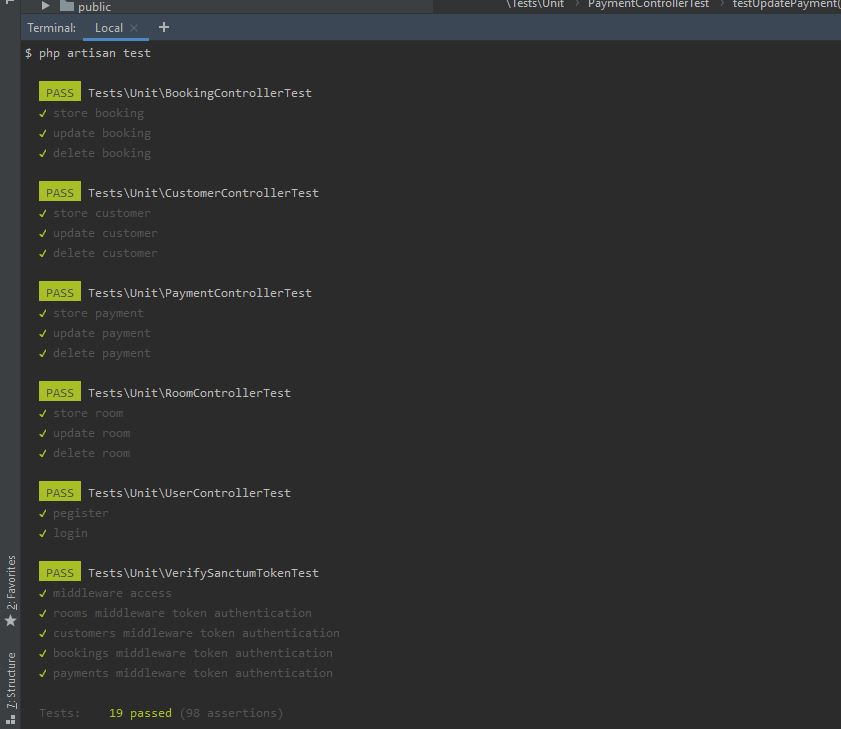
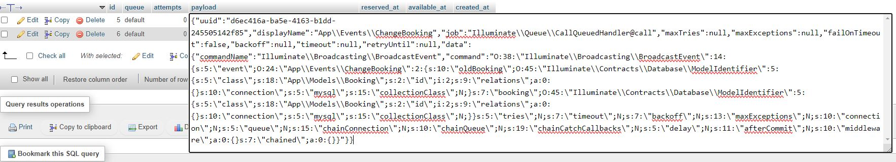
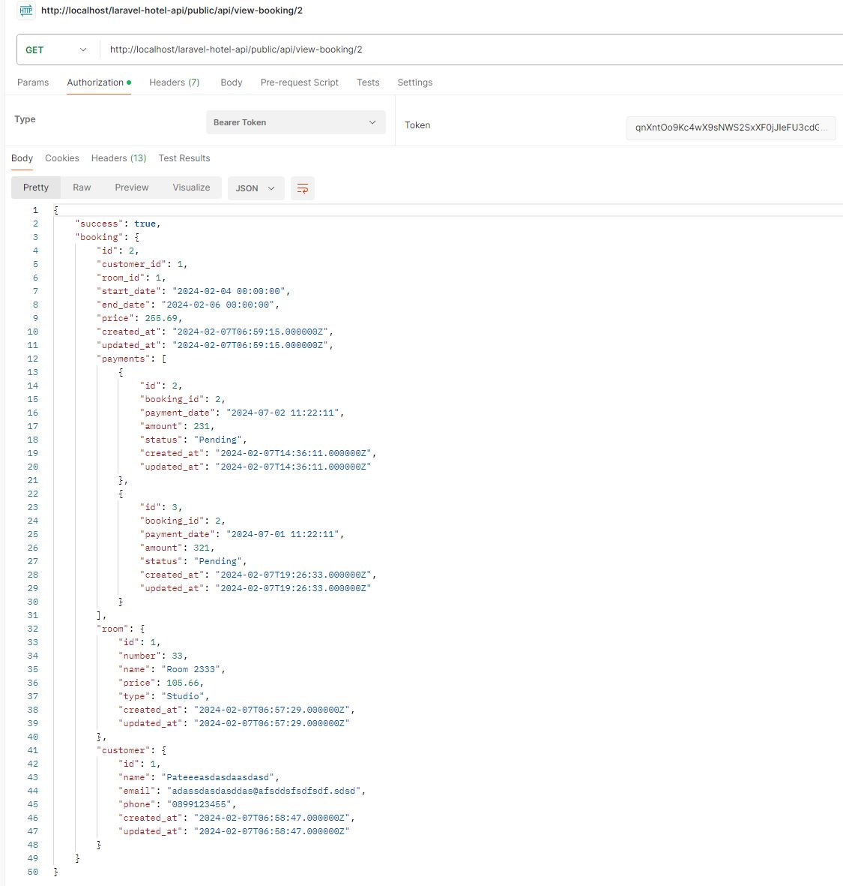
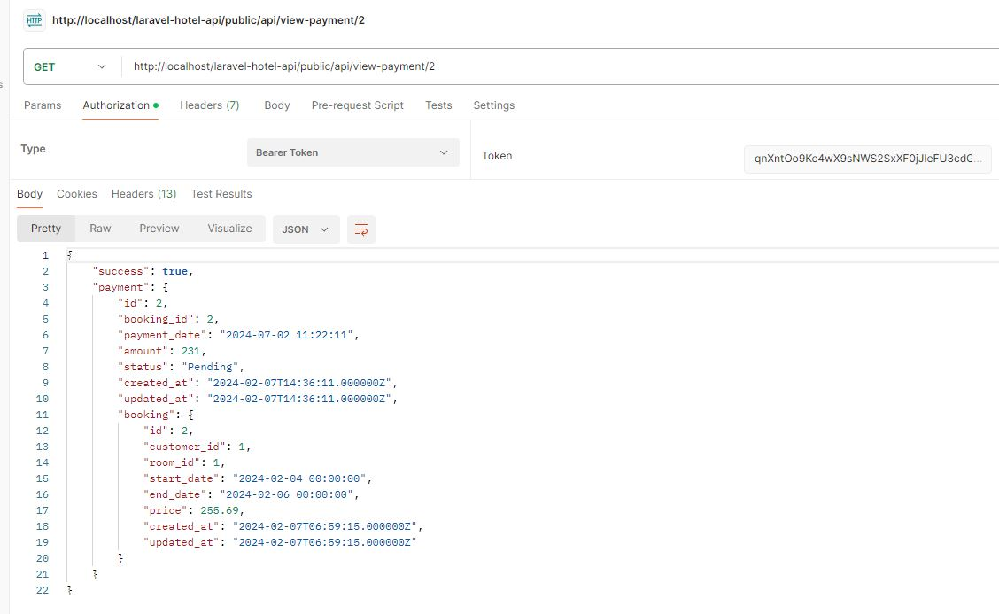
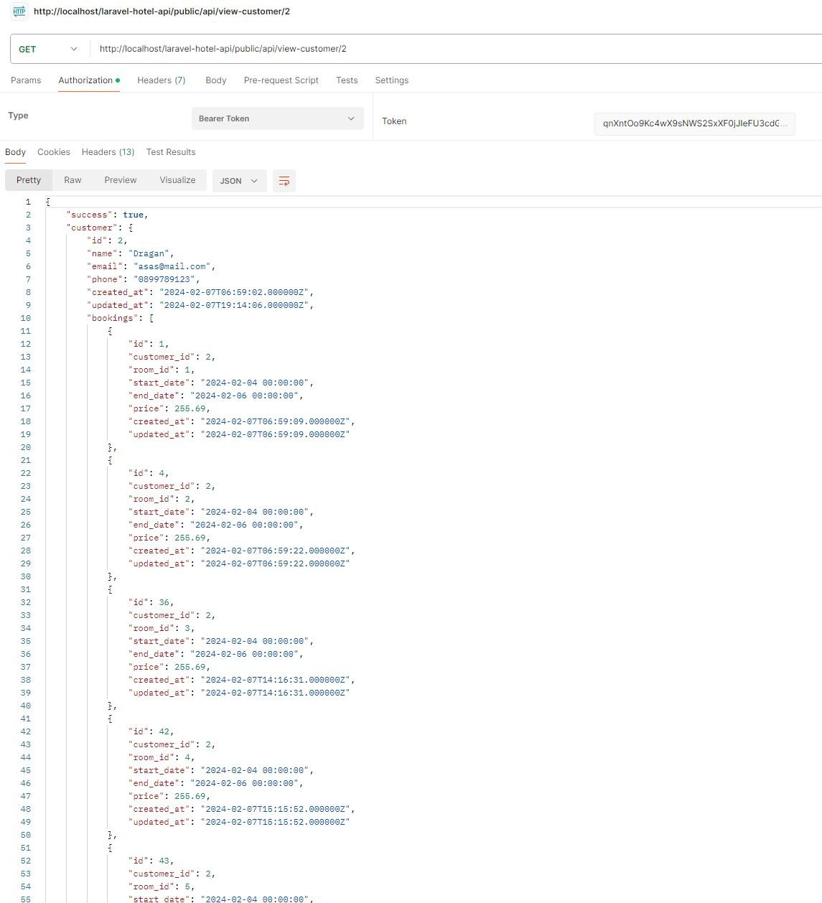

<p align="center"><a href="https://laravel.com" target="_blank"></a></p>

<p align="center">
<a href="https://github.com/laravel/framework/actions"></a>
<a href="https://packagist.org/packages/laravel/framework"></a>
<a href="https://packagist.org/packages/laravel/framework"></a>
<a href="https://packagist.org/packages/laravel/framework"></a>
</p>

## About the task

- Create a simple API for a Hotel Booking System using Laravel to manage hotel rooms, bookings, and customer interactions. 
- You are tasked with building a system for a hotel chain to streamline their room booking process,
manage customer interactions, and handle payments securely. The system needs to track room availability, manage booking, handle customer details, and payment

##### Models and Relationships:

- Models: Room, Booking, Customer, Payment
- A Room can have many Bookings.
- A Booking belongs to one Room and one Customer.
- A Customer can have many Bookings.
- A Booking can have many Payments.

##### Attributes:

- Room: number, type, price_per_night, status
- Booking: room_id, customer_id, check_in_date, check_out_date, total_price
- Customer: name, email, phone_number
- Payment: booking_id, amount, payment_date, status

##### Implement RESTful API endpoints to handle:

- Room management (retrieval, creation, and detailed view)
- Booking management (retrieval and creation)
- Customer management (retrieval and creation)
- Payment recording against a booking

##### Implement RESTful API endpoints to handle:

- Implement token-based authentication.
- Only authenticated users can add rooms, create bookings, add customers, and record payments.

##### Validation and Error Handling:

- Ensure all input data is validated
- Implement proper error handling for bad requests and unauthorized access.

##### Additionals:

- Implement a room availability checker to prevent double bookings.
- Implement a notification system that alerts hotel staff when a new booking is made or canceled.
- Use Laravel’s event and listener system with using laravel queues to handle these notifications. 
- Include unit tests to ensure that all API functionality works as expected.


## Implementation

- Clone the repository
- Install dependencies: ``` composer install ```
- Configure database connection in .env
- Add database migration tables:  ``` php artisan migrate ```

- To run queues, start the process:  ``` php artisan queue:work ```

#### Configure Unit Tests
- Create second database for using in unit tests

- Add the db credentials into .env file:

- ``` DB_TEST_DATABASE=test_db ```
- ``` DB_TEST_USERNAME=test_db_username ```
- ``` DB_TEST_PASSWORD= test_db_password ```

- Run migrations into test database: ``` php artisan migrate:fresh --database=testing ```



#### Use Postman for tests

- Navigate to registration page http://localhost/PROJECT-FOLDER/public/api/register and make new User:
 
 

- Login in http://localhost/PROJECT-FOLDER/public/api/login to get your token

 

- You must use this token inside all future API requests, following this example:

 

#### Use x-www-form-urlencoded

 

#### Routes

 

#### Queue payload

 

#### Examples

 

 

 






 
 

 