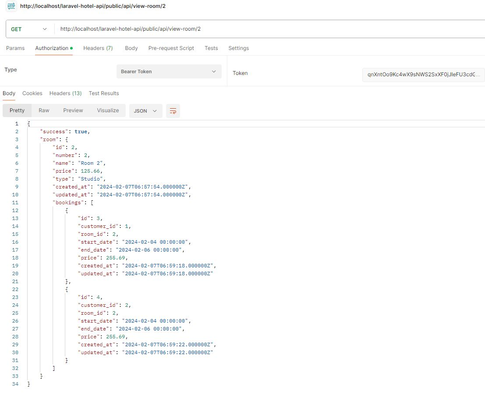

## Hotel Api

- Clone the repository
- Install dependencies: composer install
- Configure database connection in .env
- Add database migration tables:  php artisan migrate

### Use Postman for tests

- Navigate to registration page http://localhost/PROJECT-FOLDER/public/api/register and make new User:
 
 

- Login in http://localhost/PROJECT-FOLDER/public/api/login to get your token

 

- You must use this token inside all future API requests, following this example:

 

### Use x-www-form-urlencoded

 

### Routes

 

### Examples

 
 

 

 

 